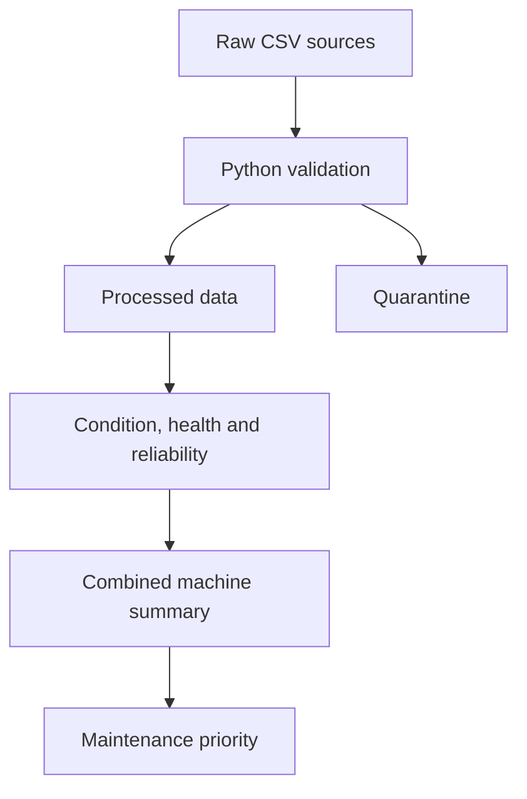

# Machine Maintenance and Uptime Data Pipeline

## Status

**ACTIVE BUILD** — The local CSV pipeline works; the Databricks version is still planned.

This is an early Python and CSV project. It checks machine, sensor, and maintenance records, keeps bad rows in quarantine, calculates condition and reliability values, and creates a combined machine summary. Databricks, Delta Lake, CDC, streaming, ML, and production deployment are not built yet.

## Problem

Machine details, sensor readings, and maintenance records often sit in separate files or systems. A stable machine ID is needed before condition, failure history, downtime, and maintenance work can be compared correctly.

## Current MVP

The local pipeline uses Python's standard library and CSV files. It validates three inputs, keeps rejected records with reasons, calculates condition and reliability values, builds a combined machine file, and ranks machines for maintenance review. The sample has five valid machines and a few bad rows included to test quarantine.

## Architecture

**State:** Implemented local MVP



This diagram shows the local code that works now. The Databricks version is not built yet.

Maintainable diagram sources:

- [System overview](docs/architecture/system-overview.md)
- [Current Python MVP](docs/architecture/current-mvp.md)
- [Validation and quarantine flow](docs/architecture/validation-flow.md)
- [Conceptual ER model](docs/data-model/conceptual-er.md)
- [Logical ER model](docs/data-model/logical-er.dbml)
- [Future Databricks lakehouse](docs/architecture/future-lakehouse.md)

## Machine ID

Every machine receives a permanent `AST-<SEQUENCE>` value in the existing `asset_id` field. Plant, machine type, production line, location, and status stay as separate attributes. The rules are in [`docs/asset_identity.md`](docs/asset_identity.md).

## Data Sources

- Machine master: ID, type, plant, line, manufacturer, installation date, criticality, and status.
- IoT telemetry: timestamped temperature, vibration, speed, current, pressure, and operating state.
- Maintenance work orders: maintenance type, dates, failure code, technician, parts, cost, downtime, and status.

All included data is synthetic and public-safe.

## Data Quality & Quarantine

The validation scripts check identifiers, referenced assets, allowed codes and statuses, dates, numeric values, and source-specific rules. Invalid rows are written to `data/quarantine/` with an `error_reason`; they are not silently deleted.

## Machine Condition

`src/build_asset_condition.py` selects the latest valid telemetry reading for each machine. `src/calculate_health_score.py` uses simple rules to create a 0–100 health score and status. This is a batch result from the latest reading, not live monitoring or prediction.

## Reliability Metrics

`src/calculate_reliability.py` derives maintenance events, failure events, total downtime, MTTR, and availability. Availability uses a fixed 30-day sample window for the MVP, so it is not a production SLA measure.

## Combined Machine Summary

`src/build_asset_360.py` joins the machine master, maintenance totals, health, and reliability results into `data/gold/asset_360.csv`. The filename stays unchanged because it is used by the working code. It is a local output file, not a live service.

## Maintenance Priority

`src/calculate_maintenance_priority.py` produces a rule-based ranking. It supports inspection of the MVP logic; it is not an automated maintenance decision or validated predictive model.

## Files and Outputs

- Python validation, processing, metric, and Gold-building scripts.
- Source, validated, quarantined, and Gold CSV datasets.
- Invalid sample rows with recorded rejection reasons.
- Gold outputs for condition, health, reliability, the combined machine summary, and maintenance priority.
- Business-context and machine-ID documentation.

There is no automated test suite yet. Current verification consists of executing the documented workflow and inspecting the generated outputs.

## Local Execution

The project uses only Python's standard library, so no extra packages are required. Python 3.9 or newer is recommended.

Execution sequence from the project root:

```bash
python src/validate_asset_master.py
python src/validate_maintenance.py
python src/validate_telemetry.py
python src/process_maintenance.py
python src/process_telemetry.py
python src/build_asset_condition.py
python src/calculate_health_score.py
python src/calculate_reliability.py
python src/build_asset_360.py
python src/calculate_maintenance_priority.py
```

The final results are written to `data/gold/`. Primary outputs:

- `asset_360.csv` for the combined view of every machine.
- `maintenance_priority.csv` for the ranked maintenance list.

## Repository Structure

```text
data/
  raw/          Synthetic source inputs
  processed/    Validated records
  quarantine/   Rejected records and reasons
  gold/         Current analytical outputs
docs/           Business context and machine ID rules
src/            Validation, processing, metric, and Gold-building scripts
```

## Current Limitations

- File-based, single-machine batch execution over a small synthetic dataset.
- No live plant or employer data.
- No orchestrator, database, catalog, API, authentication, dashboard, production monitoring, or lineage service.
- No automated tests, CDC, SCD Type 2 history, late-data policy, backfill framework, or formal idempotency contract.
- Health and priority calculations are rules, not validated predictive models.

## Databricks Lakehouse Roadmap

The next engineering phase is to design and implement Bronze, Silver, and Gold Delta tables; PySpark transformations; orchestration; schema enforcement; data-quality evidence; and reproducible deployment assets. These remain planned until code and verification evidence are added.

## CDC / SCD Type 2 Roadmap

Planned work includes source change contracts, incremental checkpoints, idempotent Delta `MERGE`, late-arriving changes, history-preserving asset attributes, effective dates, current-row flags, replay, and backfill tests. None of this is implemented in the current MVP.

## Testing & Observability Roadmap

Planned work includes unit and integration tests, data-contract tests, reconciliation, freshness and volume monitoring, run metadata, structured logs, failure scenarios, and CI. Test counts or coverage are not claimed yet.

## ML / Agentic AI Future Direction

Later experiments may test failure-risk or remaining-life models after better history and a clear baseline exist. A future assistant could search machine history, but it must not invent records, declare the final root cause, or change production or maintenance systems.

## Open-source and Research References

These links are design and learning references. They do not mean the current CSV MVP uses or implements each source.

- [NASA Prognostics Center of Excellence data repository](https://www.nasa.gov/content/prognostics-center-of-excellence-data-set-repository) — public degradation and prognostics datasets for later failure-model experiments.
- [UCI AI4I 2020 Predictive Maintenance Dataset](https://archive.ics.uci.edu/dataset/601/ai4i+2020+predictive+maintenance+dataset) — a small public dataset for checking feature and label ideas.
- [OPC UA overview](https://opcfoundation.org/about/opc-technologies/opc-ua/) — an industrial interoperability reference for future machine-data ingestion.
- [Apache Spark documentation](https://spark.apache.org/docs/latest/) — reference for the planned distributed-processing phase.
- [Delta Lake documentation](https://docs.delta.io/latest/index.html) — reference for future table history, merge, and lakehouse work.

## Case Study

[Portfolio case study](https://souravkh-7.github.io/git_portfolio/projects/manufacturing-asset-lifecycle.html)

## Blog

No dedicated project blog post is published yet.
