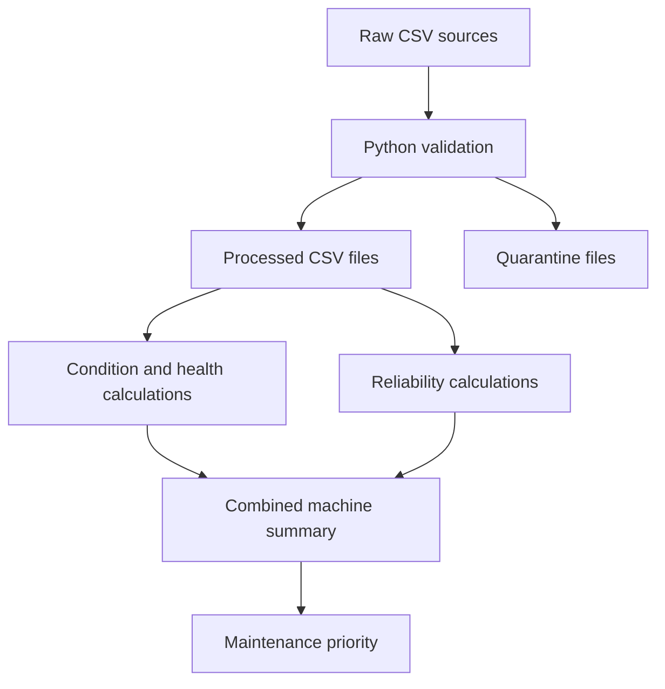

# Current Python MVP architecture

**State:** Implemented

The diagram represents the current file-based implementation. It does not represent Databricks, streaming, CDC, or production orchestration.
