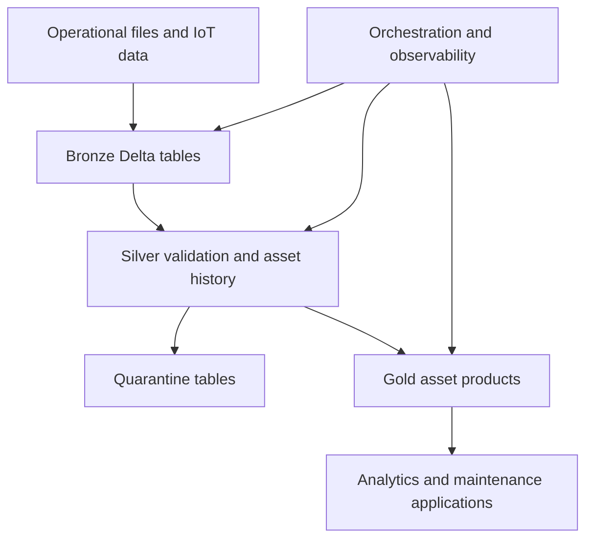

# Future Databricks lakehouse architecture

**State:** Planned

This target is separate from the implemented local MVP.

CDC, SCD Type 2, streaming, production monitoring, and ML remain future engineering phases.

