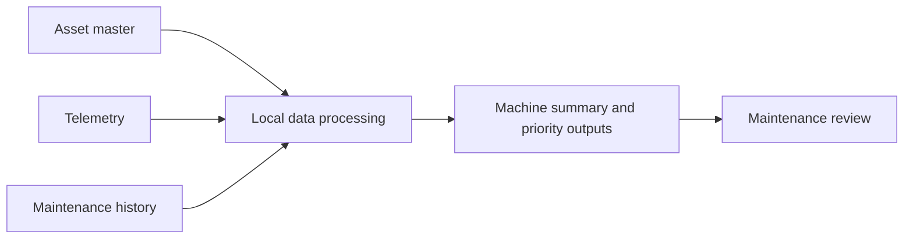

# System overview

**State:** Current local MVP

The system joins three synthetic data sources into one machine-level view for maintenance review.

```mermaid
flowchart LR
    A[Asset master]
    B[Telemetry]
    C[Maintenance history]
    D[Local data processing]
    E[Machine summary and priority outputs]
    F[Maintenance review]

    A --> D
    B --> D
    C --> D
    D --> E
    E --> F
```
