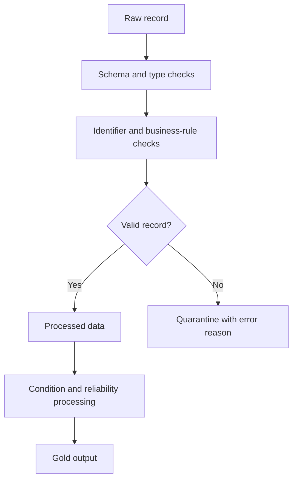

# Validation and quarantine flow

**State:** Implemented

```mermaid
flowchart TD
    A[Raw record]
    B[Schema and type checks]
    C[Identifier and business-rule checks]
    D{Valid record?}
    E[Processed data]
    F[Quarantine with error reason]
    G[Condition and reliability processing]
    H[Gold output]

    A --> B
    B --> C
    C --> D
    D -->|Yes| E
    D -->|No| F
    E --> G
    G --> H
```

