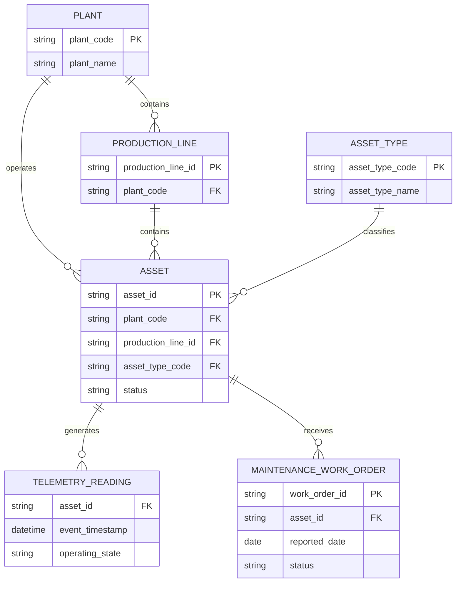

# Conceptual manufacturing ER model

**State:** Current business model

Plant, production line, and asset type are attributes in the current CSV implementation. They are shown as conceptual entities to make the business relationships explicit.

